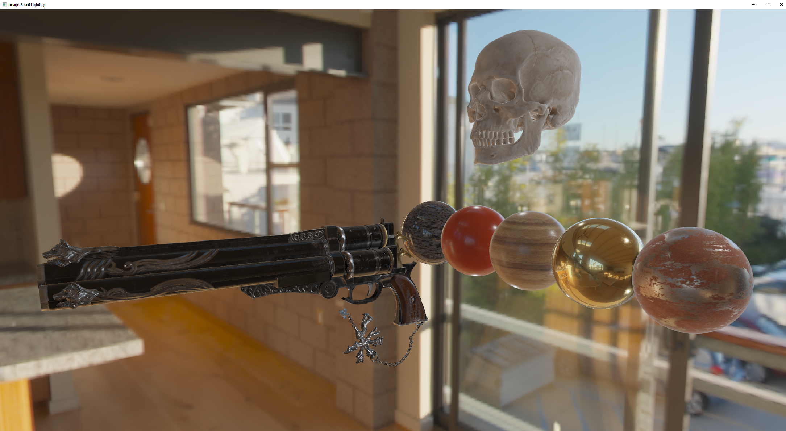
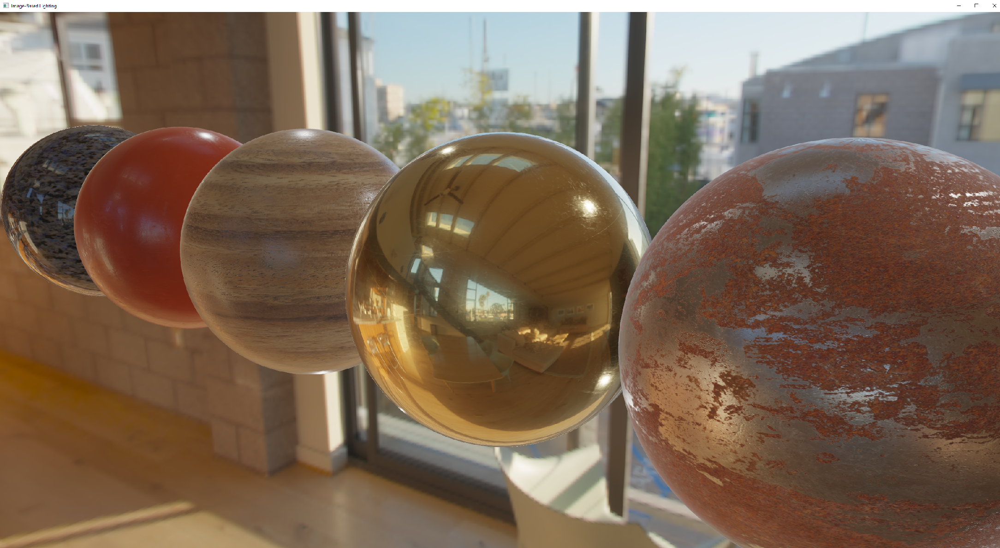
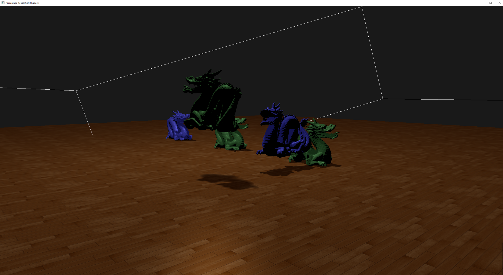
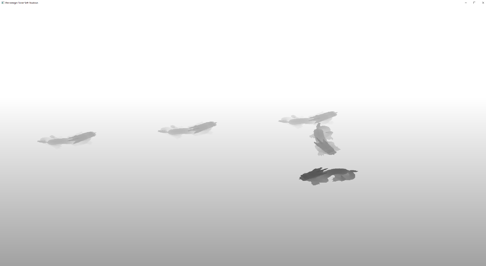
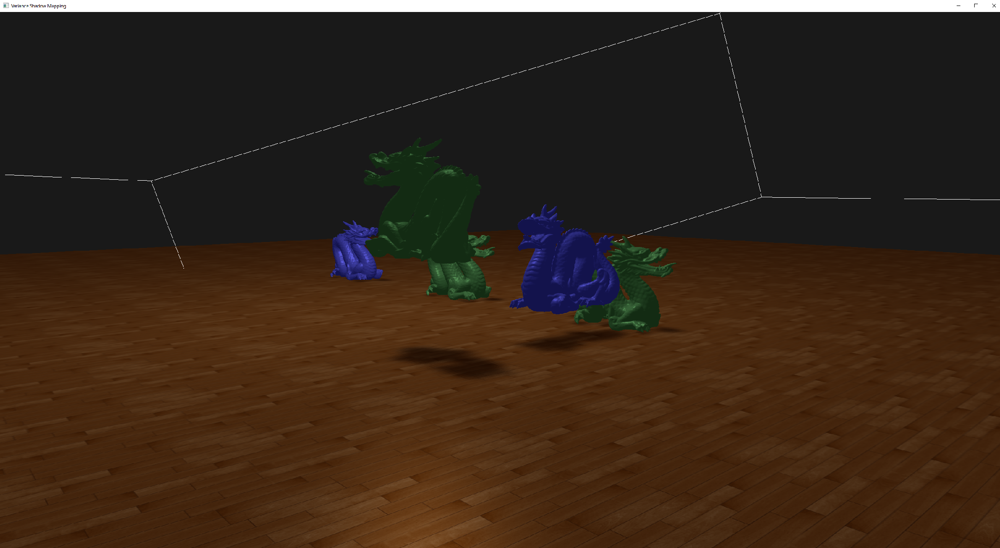
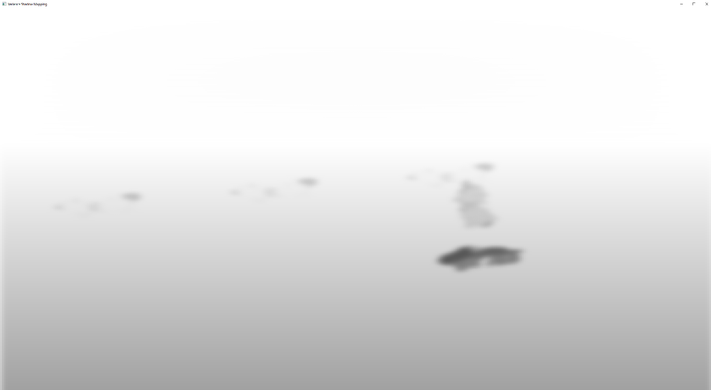
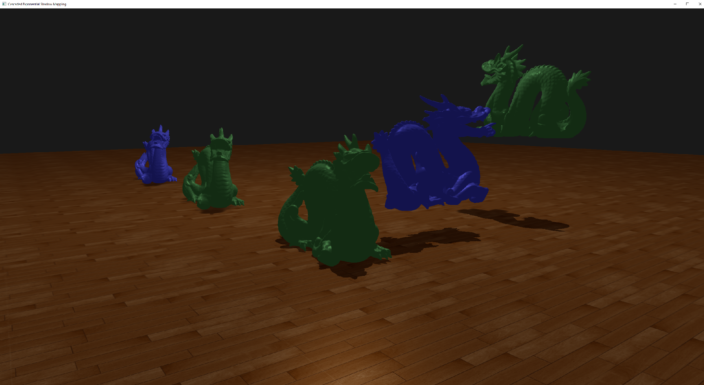

# Phoenix-Engine
Real-time physically based renderin'.

### Features
Variance shadow mapping with Gaussian filtering using a ping-pong FBO, percentage-closer soft shadows using Poisson disk sampling, cascaded shadow mapping, and physically based rendering with image-based lighting.

Mesh loading using Assimp.
Texture loading using nothings' stb library.

### Dependencies
Glad, GLFW, OpenGL Mathematics (GLM), and Assimp.

### Screenshots

### Resources
Brian Karis' [Real Shading in Unreal Engine 4](https://cdn2.unrealengine.com/Resources/files/2013SiggraphPresentationsNotes-26915738.pdf)
Real-Time Rendering
Andrew Lauritzen on Variance Shadow Maps in [GPU Gems 3](https://developer.nvidia.com/gpugems/GPUGems3/gpugems3_ch08.html)
Jan Kautz' [Exponential Shadow Maps](http://jankautz.com/publications/esm_gi08.pdf)