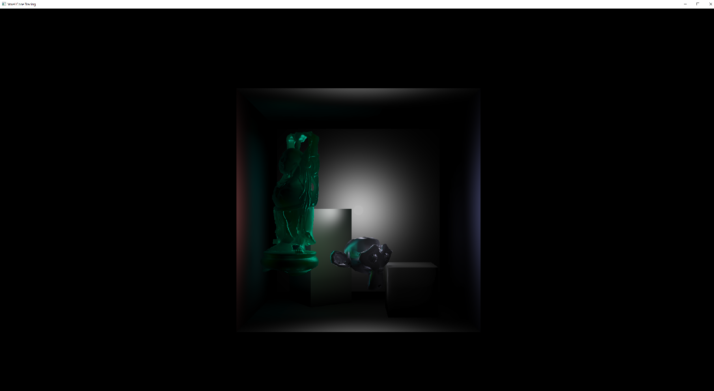
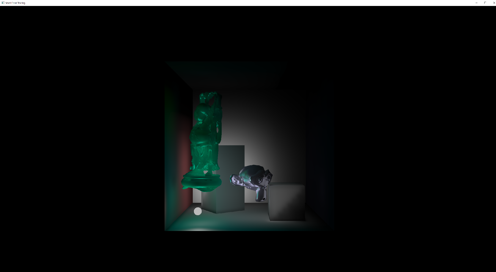
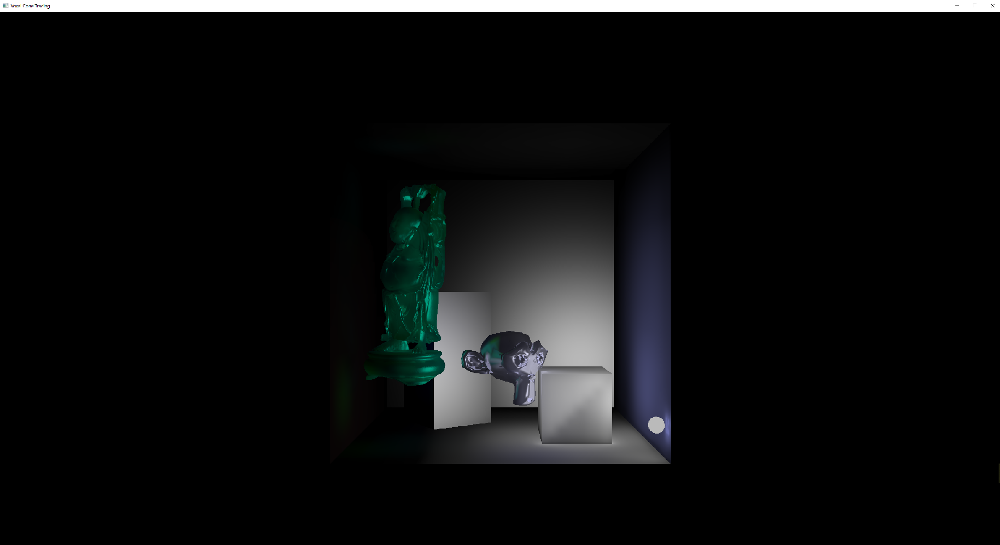
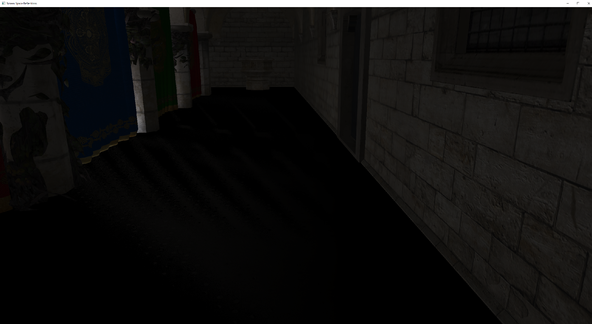

# Phoenix Engine
Real-time physically based renderin'.

### Features
Variance shadow mapping with Gaussian filtering using a ping-pong FBO, percentage-closer soft shadows using Poisson disk sampling, cascaded shadow mapping, screen space reflections using deferred shading and ray marching, physically based rendering with image-based lighting, and indirect illumination using voxel cone tracing.

Mesh loading using Assimp.  
Texture loading using nothings' stb library.

### Dependencies
Glad, GLFW, OpenGL Mathematics (GLM), and Assimp.

### Screenshots

 Representation of the Scene")

### Resources
Brian Karis' [Real Shading in Unreal Engine 4](https://cdn2.unrealengine.com/Resources/files/2013SiggraphPresentationsNotes-26915738.pdf)  
Real-Time Rendering  
Andrew Lauritzen on Variance Shadow Maps in [GPU Gems 3](https://developer.nvidia.com/gpugems/GPUGems3/gpugems3_ch08.html)  
Jan Kautz' [Exponential Shadow Maps](http://jankautz.com/publications/esm_gi08.pdf)  
Cyril Crassin's [Interactive Indirect Illumination Using Voxel Cone Tracing](https://research.nvidia.com/sites/default/files/pubs/2011-09_Interactive-Indirect-Illumination/GIVoxels-pg2011-authors.pdf)  
[Graphics Deep Dive: Cascaded voxel cone tracing in The Tomorrow Children](https://www.gamasutra.com/view/news/286023/Graphics_Deep_Dive_Cascaded_voxel_cone_tracing_in_The_Tomorrow_Children.php)